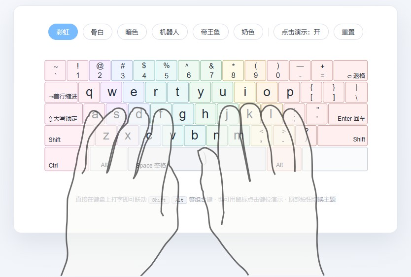
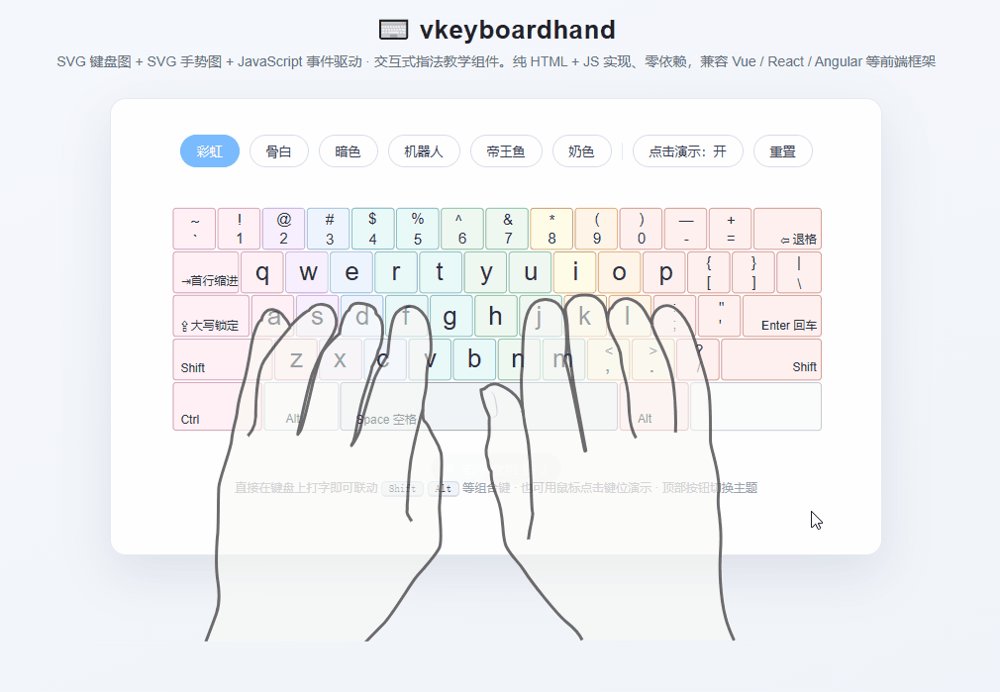

# ⌨️ vkeyboardhand

Interactive Virtual Keyboard Touch-Typing Teaching Component

An interactive virtual touch-typing teaching system powered by an **SVG keyboard + SVG hand-gesture diagram + JavaScript event-driven** integration. Pure HTML + JS, zero dependencies, compatible with **Vue / React / Angular** and other front-end frameworks, supporting **local import, CDN, and npm** usage.

**Repository**: [GitHub](https://github.com/ayuday/vkeyboardhand) · [Issues](https://github.com/ayuday/vkeyboardhand/issues) · [npm](https://www.npmjs.com/package/vkeyboardhand)

<p align="center">
  <a href="https://www.npmjs.com/package/vkeyboardhand" target="_blank"></a>
  
  
  
  
  
</p>

[English](README.md) | [简体中文](README_zh.md) | [日本語](README_ja.md) | [한국어](README_ko.md) | [Русский](README_ru.md) | [Português](README_pt.md) | [Español](README_es.md)

<p align="center">
  
</p>
<p align="center">
  
</p>


## Features

- 🎹 SVG keyboard + 🖐 SVG hand-gesture linkage: press a real key (or click a key) and the matching key lights up, the hand gesture switches in sync, and a finger-hint bar shows "which finger presses which key" in real time.
- ⌨️ `KeyboardEvent`-driven: listens to `keydown` / `keyup`, supports combo gestures like `Shift` / `Alt`.
- 🎨 Rainbow color scheme (default theme): keys are colored by finger zones, cold on the left and warm on the right to form a rainbow gradient (see `colorful.md` for the color conventions).
- 🧩 Framework-agnostic: the component only manipulates the DOM, depends on no framework, and works directly in Vue / React / Angular.
- 📦 Three import methods: local `<script>`, CDN, npm + ESM.
- ⚙️ Full API: `press / release / play / reset / setTheme / setClickEnabled / getState / destroy` plus event callbacks.
- 🗂 Key mapping table (data layer): a three-layer `key → finger → SVG id` mapping that can be overridden via config.

## Tech Stack

- **SVG (injected inline)**: keyboard diagram + finger gesture diagram
- **JavaScript DOM manipulation**: controls SVG element visibility and styles
- **KeyboardEvent API**: listens to user key presses
- **CSS Transition / Animation**: key-press animations, highlight transitions
- **Key mapping table (data)**: `key → finger → SVG id` correspondences
- **fetch / inline**: loads SVG files

## Installation

### Method 1: Pure HTML + JS (local import / CDN)

```html
<!-- Component styles -->
<link rel="stylesheet" href="dist/vkeyboardhand.css">
<!-- Component script (UMD, mounted as window.VKeyboardHand) -->
<script src="dist/vkeyboardhand.umd.js"></script>

<div id="demo"></div>

<script>
  var kb = VKeyboardHand.create('#demo', {
    keyboard: './svg/keyboard.svg', // keyboard SVG (URL / inline string / SVGElement)
    hand: './svg/hand.svg'          // hand-gesture SVG
  });
</script>
```

Once published to npm, it can be used directly from a CDN (jsDelivr / unpkg):

```html
<link rel="stylesheet" href="https://cdn.jsdelivr.net/npm/vkeyboardhand@latest/dist/vkeyboardhand.css">
<script src="https://cdn.jsdelivr.net/npm/vkeyboardhand@latest/dist/vkeyboardhand.umd.js"></script>
<!-- or -->
<link rel="stylesheet" href="https://unpkg.com/vkeyboardhand@latest/dist/vkeyboardhand.css">
<script src="https://unpkg.com/vkeyboardhand@latest/dist/vkeyboardhand.umd.js"></script>
```

> The keyboard and hand-gesture SVGs can be fetched from the package: `https://cdn.jsdelivr.net/npm/vkeyboardhand@latest/svg/keyboard.svg`, `.../svg/hand.svg`.

### Method 2: npm install (Vue / React / Angular)

```bash
npm install vkeyboardhand
```

```js
// Import styles (in the entry file or a component)
import 'vkeyboardhand/vkeyboardhand.css';
// Import the component
import VKeyboardHand from 'vkeyboardhand';

const kb = VKeyboardHand.create(document.getElementById('demo'), {
  keyboard: '/assets/svg/keyboard.svg',
  hand: '/assets/svg/hand.svg'
});
```

> Note: `keyboard` / `hand` accept **SVG file URLs, SVG strings, or existing SVGElement** as sources. In bundlers you can also `import kbSvg from 'vkeyboardhand/svg/keyboard.svg?raw'` and pass the string directly.

#### Vue 3

```vue
<template>
  <div ref="host"></div>
</template>

<script setup>
import { ref, onMounted, onBeforeUnmount } from 'vue';
import VKeyboardHand from 'vkeyboardhand';

const host = ref(null);
let kb = null;

onMounted(() => {
  kb = VKeyboardHand.create(host.value, {
    keyboard: '/assets/svg/keyboard.svg',
    hand: '/assets/svg/hand.svg'
  });
});

onBeforeUnmount(() => kb && kb.destroy());
</script>
```

#### React

```jsx
import { useEffect, useRef } from 'react';
import VKeyboardHand from 'vkeyboardhand';

export default function FingerTeaching() {
  const host = useRef(null);

  useEffect(() => {
    const kb = VKeyboardHand.create(host.current, {
      keyboard: '/assets/svg/keyboard.svg',
      hand: '/assets/svg/hand.svg'
    });
    return () => kb.destroy();
  }, []);

  return <div ref={host} />;
}
```

#### Angular

```ts
import { Component, ElementRef, ViewChild, AfterViewInit, OnDestroy } from '@angular/core';
import VKeyboardHand from 'vkeyboardhand';

@Component({
  selector: 'app-finger-teaching',
  template: `<div #host></div>`
})
export class FingerTeachingComponent implements AfterViewInit, OnDestroy {
  @ViewChild('host', { static: true }) host!: ElementRef<HTMLDivElement>;
  private kb: VKeyboardHand | null = null;

  ngAfterViewInit(): void {
    this.kb = VKeyboardHand.create(this.host.nativeElement, {
      keyboard: 'assets/svg/keyboard.svg',
      hand: 'assets/svg/hand.svg'
    });
  }

  ngOnDestroy(): void { this.kb?.destroy(); }
}
```

> Fully runnable examples live in [`examples/`](./examples): `vue.html`, `react.html`, `esm.html`, `angular/app.component.ts`.

## API Reference

### Options

| Option | Type | Default | Description |
| --- | --- | --- | --- |
| `keyboard` | `string \| SVGElement` | `'./svg/keyboard.svg'` | Keyboard SVG: URL / inline string / element |
| `hand` | `string \| SVGElement` | `'./svg/hand.svg'` | Hand-gesture SVG: URL / inline string / element |
| `theme` | `string` | `'colorful'` | Theme: `colorful` (default rainbow) / `bone` / `dark` / `robot` / `kingfish` / `milk` |
| `listenKeyboard` | `boolean` | `true` | Whether to listen to the real keyboard |
| `enableClick` | `boolean` | `true` | Whether clicking keys is allowed for demo |
| `preventScroll` | `boolean` | `true` | Prevent spacebar / arrow keys etc. from scrolling the page |
| `showFingerLabel` | `boolean` | `true` | Show the finger-hint bar |
| `showFingerColors` | `boolean` | `false` | Color keys by finger (on by default in the `colorful` theme, can be enabled manually in others) |
| `showBanner` | `boolean` | `true` | Print a version + repository banner to the console after init |
| `showHandBoth` | `boolean` | `true` | How natural hands are shown while a key is held: `true` keeps both neutral hands visible as a background next to the pressed gesture; `false` replaces the same-side neutral hand with the key gesture (hidden) while the opposite-side neutral hand stays visible; both neutral hands return after release |
| `holdDelay` | `number` | `80` | Hand-gesture transition delay (ms) |
| `keyboardClass` | `string` | `'standard-kb'` | Extra class name for the keyboard SVG |
| `keyMap` | `object` | `KEY_MAP` | Override the `KeyboardEvent.code → key` mapping |
| `fingerMap` | `object` | `FINGER_MAP` | Override the `key → finger` mapping |
| `onReady(kb)` | `function` | - | Fires when the component has loaded and rendered |
| `onKeyDown(info, kb)` | `function` | - | Key-down callback |
| `onKeyUp(info, kb)` | `function` | - | Key-up callback |
| `onKeyClick(info, kb)` | `function` | - | Key-click callback |
| `onError(err)` | `function` | - | Load / render error callback |

### Instance Methods

| Method | Description |
| --- | --- |
| `press(key, meta?)` | Press a specified key (`key` is the key name, e.g. `'q'`, `'shift-left'`) |
| `release(key, meta?)` | Release a specified key |
| `play(keys, options?)` | Play a sequence of keys (e.g. `kb.play('hello')`) with per-key hold time & gap, plus optional `loop` auto-repeat; returns a Promise |
| `reset()` | Reset all highlights and gestures (back to both hands' natural resting position) |
| `setTheme(theme)` | Switch theme |
| `setClickEnabled(bool)` | Enable / disable click-to-demo |
| `setShowHandBoth(bool)` | Enable / disable keeping both neutral hands visible while pressing |
| `getState()` | Get the list of currently held keys |
| `getFinger(key)` | Get the finger info for a key |
| `destroy()` | Destroy the component, release listeners and DOM |

Example callback payload:

```js
{
  key: 'q',            // key name
  code: 'q',           // compatibility field
  finger: 'lp',        // finger id
  fingerName: 'left pinky', // finger name
  held: ['q']          // all keys currently held
}
```

### Finger IDs and Colors

| finger id | Meaning | Default color |
| --- | --- | --- |
| `lp` | left pinky | `#ff9f43` |
| `lr` | left ring finger | `#f368e0` |
| `lm` | left middle finger | `#17c0eb` |
| `li` | left index finger | `#1dd1a1` |
| `ri` | right index finger | `#0abde3` |
| `rm` | right middle finger | `#a29bfe` |
| `rr` | right ring finger | `#fd79a8` |
| `rp` | right pinky | `#fdcb6e` |
| `th` | thumb (spacebar) | `#6c5ce7` |

Can be overridden via CSS variables:

```css
.vk-hand {
  --vk-finger-lp: #ff6348;
  --vk-accent: #38bdf8; /* key-press highlight color */
}
```

### Rainbow Theme Colors (colorful.md conventions)

In the default `colorful` theme, keycaps are colored by finger zone, with border / background colors from `colorful.md`:

| Finger | Border color | Background color |
| --- | --- | --- |
| Left pinky | `#d6a0b9` pink | `#fff0f6` light pink |
| Left ring | `#c6a4df` purple | `#f7efff` light purple |
| Left middle | `#9fb4e3` blue-purple | `#eef4ff` light blue-purple |
| Left index | `#83bec2` teal | `#eaf9f8` light teal |
| Right index | `#8ac29c` green | `#eef9f1` light green |
| Right middle | `#c2bb76` yellow-green | `#fffbe8` light yellow |
| Right ring | `#d9aa71` orange | `#fff4e8` light orange |
| Right pinky | `#d69a98` red | `#fff0ef` light red |
| Thumb | `#9fa8b5` gray-blue | `#f2f4f7` light gray |

Key state follows colorful.md priority: pressed (`#303a4a` dark gray-blue solid fill + white text) overrides the rainbow background. See [colorful.md](./colorful.md) for the full conventions.

## Asset Files

- `svg/keyboard.svg`: virtual keyboard vector graphic
- `keyboard.md`: mapping of `id` selectors in svg/keyboard.svg to physical keyboard keys
- `colorful.md`: rainbow keyboard style conventions (finger-zone colors and key-state override colors)
- `keyboard.html`: style preview of the virtual keyboard vector graphic
- `svg/hand.svg`: keyboard hand-gesture vector graphic
- `hand.md`: mapping of `id` selectors in svg/hand.svg to physical keyboard key gestures
- `keyboard+hand.html`: style preview of the virtual keyboard + hand-gesture graphics
- `letter-bg-*`: keyboard key backgrounds (`<path id="letter-bg-q">`)
- `letters-*` / `letter-*`: letters or characters on keyboard keys (`<text id="letter-lower-q">`)
- `hand-*`: hand-gesture groups (`<g id="hand-q">`); the component toggles the visibility of these groups for gesture linkage

## Key Mapping (Data Layer)

The component has two built-in layers of mapping:

```text
KeyboardEvent.code  →  key name           (e.g. KeyQ → q)
key name            →  finger / SVG id    (e.g. q → lp → letter-bg-q / hand-q)
```

The default mappings live in `KEY_MAP` and `FINGER_MAP` in the source [`src/vkeyboardhand.js`](./src/vkeyboardhand.js), and can be overridden via `options.keyMap` / `options.fingerMap`:

```js
const kb = VKeyboardHand.create('#demo', {
  fingerMap: { q: 'li' } // custom: remap q to the left index finger
});
```

## Development & Build

```bash
pnpm install        # install dev dependencies (currently 0, pure Node build)
pnpm build      # generate dist/ (UMD + ESM + CSS)
pnpm preview    # local preview of index.html
```

## Directory structure:

```text
├── src/
│   ├── vkeyboardhand.js     # component source (UMD, can be included via <script>)
│   └── vkeyboardhand.css    # component styles
├── dist/
│   ├── vkeyboardhand.umd.js # UMD build (browser / CommonJS / AMD)
│   ├── vkeyboardhand.esm.mjs# ESM build (Vite / Webpack / Rollup / Node)
│   └── vkeyboardhand.css    # CSS build
├── examples/                # Vue / React / Angular / ESM examples
├── scripts/build.mjs        # build script
├── svg/                     # keyboard & gesture vector assets (keyboard.svg / hand.svg)
├── colorful.md              # rainbow keyboard style conventions
├── index.html               # component demo page
└── package.json
```


## Browser Support

Supports all modern browsers (Chrome / Edge / Firefox / Safari), relying on standard APIs: `fetch`, `DOMParser`, `classList`, `KeyboardEvent`.


## Acknowledgements
- [SVG keyboard](https://commons.wikimedia.org/wiki/File:Keyboard_US.svg) (Wikimedia Commons, CC BY-SA 4.0)
- [nvm](https://www.nvmnode.com) (NVM - Node.js Version Manager Tool)
- [markdown](https://www.markdownlang.com) (markdown)

## ⭐ Star History

<a href="https://www.star-history.com/?repos=ayuday%2Fvkeyboardhand&type=date&legend=top-left">
 <picture>
   <source media="(prefers-color-scheme: dark)" srcset="https://api.star-history.com/chart?repos=ayuday/vkeyboardhand&type=date&theme=dark&legend=top-left&sealed_token=0gMklRkZmlzMNv3aS599q52vM3sWoD-7t0rXTOufF15TqjMqydOLJcgHst4v1il1jRXmaPbU7enL5QHOIoF5SEbv5GNYTuTb_VZ0cxQCvk_BmUMnPBlvCg" />
   <source media="(prefers-color-scheme: light)" srcset="https://api.star-history.com/chart?repos=ayuday/vkeyboardhand&type=date&legend=top-left&sealed_token=0gMklRkZmlzMNv3aS599q52vM3sWoD-7t0rXTOufF15TqjMqydOLJcgHst4v1il1jRXmaPbU7enL5QHOIoF5SEbv5GNYTuTb_VZ0cxQCvk_BmUMnPBlvCg" />
   
 </picture>
</a>


## License

[MIT](./LICENSE)
